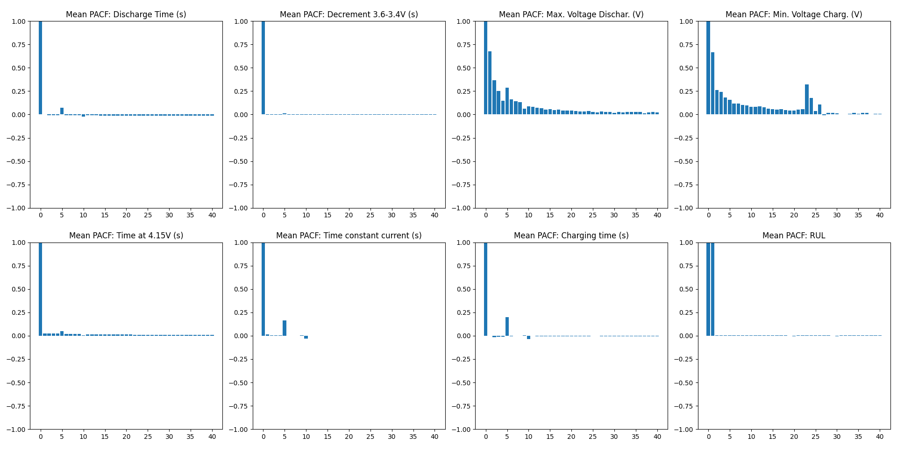
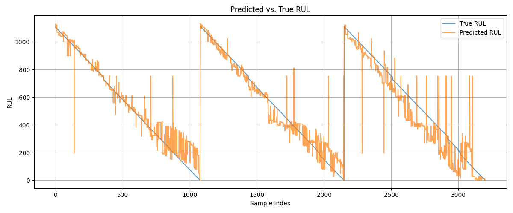
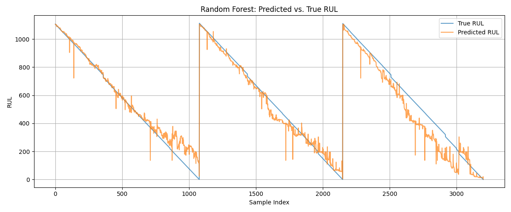
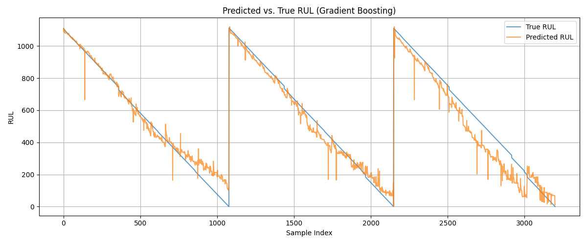
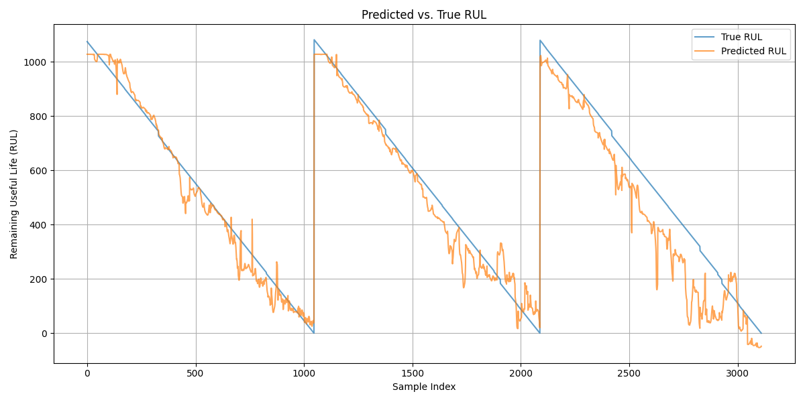

# Battery RUL Prediction with Decision Trees

This repository explores data-driven approaches for predicting **Remaining Useful Life (RUL)** of batteries using the [Battery Life Cycle dataset](https://www.kaggle.com/datasets/ignaciovinuales/battery-remaining-useful-life-rul/data) from Kaggle. It focuses on interpretable models such as **Decision Trees** and includes preprocessing, feature selection, training, and evaluation pipelines. The models provided in this repository are specifically trained on a data set derived from a particular type of lithium-based battery used in the NASA battery data set. Since the precise battery chemistry (e.g., LiCoO₂, LiFePO₄, etc.) is not specified, these models are unlikely to generalize to batteries with different chemistries, as degradation behavior can vary significantly between types.

If you intend to apply these models in practice, ensure that the underlying battery system closely matches the one represented in the original data. The safest and most reliable approach is to apply the modeling methodology from this repository to your own, system-specific data set to ensure accuracy and validity.
## Feature Selection
The dataset contains the following features:

- **Cycle_Index**
- **Discharge Time**
- **Decrement 3.6–3.4V**
- **Max. Voltage Discharge**
- **Min. Voltage Charg.**
- **Time at 4.15V**
- **Time Constant Current**
- **Charging Time**
- **RUL** (Remaining Useful Life — target)

Since RUL is the target variable, it was naturally excluded from the feature set. Additionally, Cycle_Index was dropped as well, because it correlates almost perfectly (and inversely) with RUL, which could lead to data leakage and overfitting during training.

From the remaining six features, a feature relevance analysis was conducted using SelectKBest with f_regression as the scoring function. With k=5, the following features were selected as most relevant:

- **Decrement 3.6–3.4V**
- **Max. Voltage Discharge**
- **Min. Voltage Charg.**
- **Time at 4.15V**
- **Time Constant Current**

## Feature Autocorrelation Analysis
To better understand the internal structure of the dataset, a Partial Autocorrelation Function (PACF) analysis was performed on the mean time-series data across all battery lifetimes. This helps identify the presence of significant lag relationships in the features, which is particularly useful for time-dependent modeling tasks such as RUL estimation.

### PACF Mean Results

- Features like **Max. Voltage Discharge** and **Min. Voltage Charge** exhibit stronger partial autocorrelations at non-zero lags, suggesting temporal dependencies that could be leaveraged in temporal models such as lstms.
- Most features show minimal lag correlation beyond the first few steps, indicating that a simple model may suffice for these.

## Decision Tree Regression

### Predictions vs Actual

| Mean Squared Error | Mean Absolute Error | R2        |
|--------------------|---------------------|-----------|
| 8360.46            | 62.70               | 0.9195    |

## Random Forest Regression

### Prediction vs Actual

| Mean Squared Error | Mean Absolute Error | R2        |
|--------------------|---------------------|-----------|
| 5121.01            | 49.63               | 0.9507    |

## Gradient Boosting Regression

### Prediction vs Actual

| Mean Squared Error | Mean Absolute Error | R2        |
|--------------------|---------------------|-----------|
| 4644.84            | 50.40               | 0.9552    |

## LSTM

### Prediction vs Actual

| Mean Squared Error | Mean Absolute Error | R2        |
|--------------------|---------------------|-----------|
| 7193.39            | 63.04               | 0.9267    |

## Results Overview

| Model             | Mean Squared Error | Mean Absolute Error | R2        |
|-------------------|--------------------|---------------------|-----------|
| Decision Tree     | 8360.46            | 62.70               | 0.9195    |
| Random Forest     | 5121.01            | 49.63               | 0.9507    |
| Gradient Boosting | 4644.84            | 50.40               | 0.9552    |
| LSTM              | 7193.39            | 63.04               | 0.9267    |

In comparison to the baseline Decision Tree model, the Random Forest approach achieved significantly better generalization by leveraging multiple trees in an ensemble. Gradient Boosting, which sequentially refines predictions by fitting new trees to the residuals of previous ones, yielded the best performance overall — though only slightly better than Random Forest.

Overall, Gradient Boosting demonstrated the best performance for RUL estimation in this experiment, making it a strong candidate for further development.

### Repeatability

If you want to run these experiments yourself you can simply clone the main branch. After you have cloned it run in the directory you cloned the branch to "py -m pip install -r requirements.txt" (py command syntax might change depending on how your local system is set up). After that just run in the dir "py batvis.py". You can change the used moel by callign the right function, you have to change this in the source code of the batvis.py
